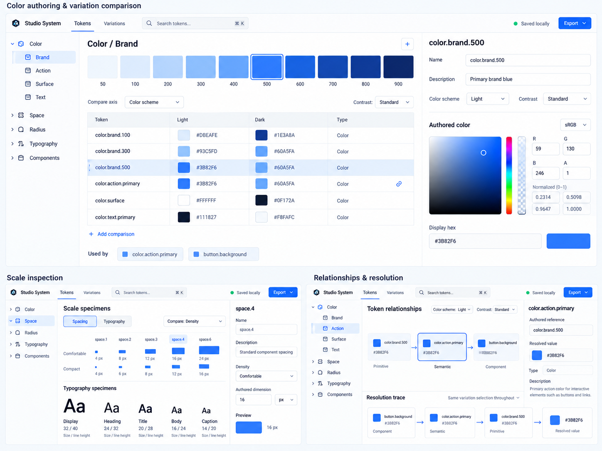

# Visual Direction

## Status and purpose

**Established visual direction — 7 October 2026**

The refined Precision-based mockup below is the accepted visual reference and source of inspiration for the Design Token Workbench. It guides subsequent interface design and prototyping for the desktop-oriented PWA designer/developer companion.

The reference establishes the visual character and preferred ways to inspect tokens. Its example data, exact controls, labels, dimensions, and screen composition remain illustrative; it is not an implementation specification or a commitment to an initial feature set.

## Accepted reference

[Open the full-size reference](./assets/visual-direction-2026-10-07.png).

This AI-generated image was refined from a six-territory exploration using the user's selected features, then accepted on 7 October 2026. The copied image in this repository is the durable reference for future work.

## Visual character and organization

- Crisp, modern, professional design-tool character, serving designers and developers together.
- A bright, restrained Precision foundation: white and cool-gray surfaces, blue active states, fine separators, clear typography, and limited rounding and elevation.
- A project-centered workbench with persistent token search, namespace navigation, a central working surface, and a contextual inspector.
- Purposeful density with enough space to scan names, values, controls, and visual specimens. Use focused views rather than placing every capability on one screen.

The desired air is that of tools such as AppVision, Penpot, and Figma. This is general inspiration rather than an instruction to copy their branding, structure, or vendor-specific token concepts.

## Preferred inspection patterns

1. **Color editing:** a color-space/model selector, the corresponding component controls, and a visual editing widget. Keep the relevant color ramp visible as context while editing a token.
2. **Variation comparison:** show resolved values side by side for different axis options or selected combinations, with visible comparison context. This pattern should extend beyond Light/Dark examples to other relevant variation axes.
3. **Scale specimens:** represent spacing and sizing through visibly increasing measurements, and typography through actual type specimens with size and line-height information.
4. **Relationships and resolution:** show how tokens relate and provide a value-resolution trace. Make authored references and resolved values separately understandable.

These patterns supplement the accepted Precision layout and search field. Their placement and detailed interactions should follow the task being performed rather than the arrangement of the presentation board.

## Alignment with the canonical model

- Comparison columns are views of [variation selections](../design-tokens/conceptual-model.md#themes-and-modes), not separate token trees. Show the compared axis or selections and the fixed context for other axes. Theme presets are reusable selections, not owners of values. Component variants and interactive states must not be conflated automatically with project-level axes.
- The color editor preserves the distinction between [authored color and derived display representations](../design-tokens/conceptual-model.md#authored-color-and-alternative-representations). A display notation or picker selection must not silently replace the authoritative authored value.
- A visual ramp or scale does not imply a persisted scale entity or live recipe. [Scale helpers](../design-tokens/conceptual-model.md#scale-generation) propose values; accepted tokens remain independently editable.
- Token paths in the mockup are readable labels. [TokenReference](../design-tokens/conceptual-model.md#tokenreference) uses stable token identity rather than mutable paths.
- Downstream usage and following references during resolution are distinct directions. [Resolution traces](../design-tokens/conceptual-model.md#variation-resolution-contract) are derived explanations under one completed variation selection, including unresolved outcomes where applicable.
- [Preview specimens](../design-tokens/conceptual-model.md#value-previews) illustrate values under explicit context; observed rendering does not redefine authored values or export behavior.

## Details still to validate

The [open questions](../planning/open-questions.md) continue to govern the first workflow, feature coverage, supported color spaces and editing policies, initial axes, preview contexts, persistence, technology choices, and export profiles. The Light/Dark, contrast, density, sRGB, HEX, token-name, and value examples in the image do not settle those questions.

Exact navigation, inspector placement, comparison interactions, responsive behavior, keyboard and focus behavior, accessibility, and final UI styling remain to be designed and verified in concrete workflows. The accepted reference provides direction for that work; no interface implementation has been started.
